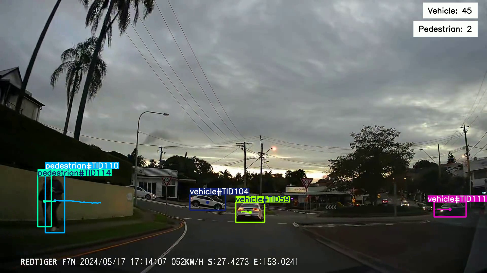

# <div align='center'>Dashcam Footage Analysis</div>

This project focuses on analyzing dashcam footage to track and count the number of vehicles and pedestrians. Utilizing YOLOv10 for object detection and ByteTrack for object tracking, this tool processes video clips to provide accurate counts and insights into traffic patterns and pedestrian movement. The project is implemented using Streamlit for the web interface, allowing users to upload and process videos with real-time progress tracking. 

## Examples



## Dataset

Here, I have used the pre-trained YOLOv10 model. However, you can also use your custom dataset to train the model.


## <div style="padding-top: 20px"> Steps to run </div>

<div style="padding-bottom:10px"><b>STEP 00 :</b> Clone the repository</div>

```bash
git clone git@github.com:utpalpaul108/Dashcam-Footage-Analysis.git
```
<div style="padding-top:10px"><b>STEP 01 :</b> Create a virtial environment after opening the repository</div>

Using Anaconda Virtual Environments

```bash
cd Dashcam-Footage-Analysis
conda create -n venv python=3.10 -y
conda activate venv
```
Or for Linux operating system, you can use that

```bash
cd Dashcam-Footage-Analysis
python3.10 -m venv venv
source venv/bin/activate
```

<div style="padding-top:10px; padding-bottom:10px"><b>STEP 02 :</b> Install the requirements</div>

```bash
pip install -r requirements.txt
```

Finally, run the following command to start your application on your desired port.
```bash
streamlit run app.py --server.port 8000
```

<div style="padding-top:10px"><b>STEP 03 :</b> Run the application</div>

Now, open up your localhost with your selected port on your web browser.
```bash
http://localhost:8080
```
